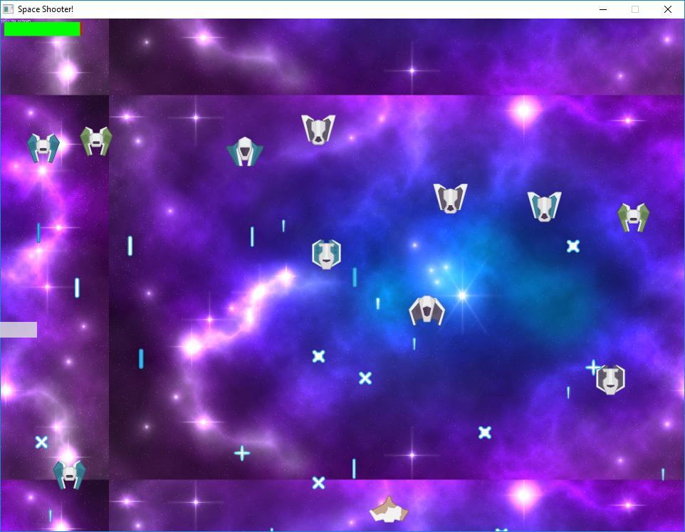
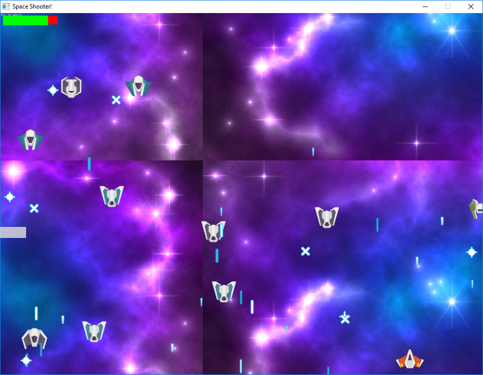

##### Space Shooter Game

1. Read SpriteSheet using xml
2. Have basic game.

The game uses CC0 basic sprites and sounds.

### Todo Right now 

- Let enemies shoot bullets, random spawning enemy function, health bar, player damaged by bullets, enemy destroyed and creates explosion class.

### Current Tasks

1. ~~Create Enemy Class, types corresponding to images and/or movement speeds, maybe random number that represents sprites.~~
2. ~~Allow collisions between player & enemy~~
3. ~~Allow enemy to shoot bullets~~
4. ~~Allow bullets to destroy enemies~~
5. ~~Random spawning of enemies~~
6. ~~level based system~~
7. ~~Health per shoot~~
8. ~~Health bars~~
9. Powerups
